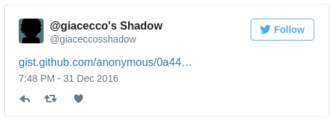

my-shadow
=========

## Introduction

> (...) social media has turned into “social peacocking” — showing yourself in a favorable light online, presenting only the happy moments, a “highlights reel” of your life, so to speak, and how this leads to FOMO in others (...) [[Caterina Fake, "Social Peacocking and the Shadow", 5 February 2015](https://caterina.net/2015/02/05/social-peacocking-and-the-shadow/)]

> (...) You never see any of the doldrums, the dullness, the boredom, the bad days, the... all of the things that are not presentable, not photogenic, (...) this constant sort of self-presentation that I call "social peacocking" is just kind of a mechanism for resentment, envy and dissatisfaction. (...) this tendency of people to productize themselves, to become a shinier, newer, more polished, quote-unquote better version of themselves, that we don't ignore large aspects of ourselves online, that our full humanity is represented there with all of its flaws. I wrote a subsequent blog post, also about The Shadow, as exemplified by Carl Jung, this idea that, you know, The Shadow, if it doesn't exist, you know, it leads to big problems, and I think that social media has a very strong tendency to ignore The Shadow. (...) The Shadow in Carl Jung are the things that we prefer not to present about ourselves, or acknowledge about ourselves, or unconscious about ourselves, such as, you know, our childishness or our envy or resentment (...) [[Caterina Fake interviewed by Manoush Zamorodi for the "When FOMO meets JOMO" episode of WNYC Note To Self, 20 January 2016, starts at 2:47](https://www.wnyc.org/story/fomo-jomo/)]

*my-shadow* is a prototype of social media service that breaks the social peacocking trap by allowing the user to unleash her Shadow.

Unleashing a Shadow is good - and possibly even healthy - but unveiling it to anybody may be inappropriate or inconvenient. With *my-shadow* your updates are accessible to your trusted circle only, using end-to-end encryption over public channels, so that there is no cost for the service.

## Do I need *my-shadow*?

Similar functionality to *my-shadow* could be implemented for example by using restricted Facebook groups, but do you really want Zuckerberg's people to snoop into your Shadow?

Alternatively, you may be disciplined enough to do the whole encryption and email sending work manually, but the metadata generated by doing that would reveal who is in your circle to whoever manages email for you, or has privileged access in monitoring the networks: your Internet provider, your government etc.

## How does it work?

You write your "update" in a simple text file, say ```message.txt```, and you publish it by doing ```./update message.txt```. In the background, the message is encrypted using [GNU PG](https://www.gnupg.org/) so that all of the readers you have previously configured can read it. The encrypted message is published pseudoanonymously on [Gist](https://gist.github.com/) (it's just *pseudo*anonymously because the people at GitHub will know it came from your IP address) and a link to it is posted to your "shadow" Twitter feed.



## How do I decide who can read me?

At the moment, it is up to you to create an original GPG keypair for each reader you want to be able to read you. There are many reasons for using original keypairs rather than your reader's pre-existing GPG public key; among these are: a) you may not want your reader to have access to your timeline straight away, but only at some time in the future, when you feel ready, and b) public keys can reveal the identity of their owner, and you may not want your readers to know who the other readers are.

The creation of the keypairs is done by running ```./create-recipient [recipient name or nickname]```. The day you are ready for your reader to actually read your timeline, you will have to find a way to share with her the keypair securely. The keys are created without a password and are stored in the ```secret``` folder. The recipient's name is not stored anywhere in the keys, but only in the names of the files. It is important you keep that folder secure, and you may not want to backup it conventionally, e.g. on an external hard disk or on Amazon AWS without a further layer of encryption.

You can remove a reader from the recipients who can read your future messages by deleting her keypair from the ```secret``` folder.

## Requirements
*my-shadow* was developed and tested on Fedora 24. It should work without changes on most Linux distributions and, with little adaptation, on Mac. Requirements are:

- GPG 1.x
- [sferik/t](https://github.com/sferik/t), a command line Twitter client
- [defunkt/gist](https://github.com/defunkt/gist), a command line Gist client

## Installation
1. Install the *gpg*, *t* and *gist* binaries, so that they are in the $PATH.
2. Configure *t* and move the Twitter credentials file created by doing so from ```~/.trc``` to ```secret/twitter.credentials```. Test to see if *t* works, e.g. by reading someone else's timeline: ```t timeline giacecco --profile=secret/twitter.credentials```.

## What's next

Assuming you want someone to read you, it is not an easy job for them, as they need to manually decrypt the messages posted on Gist. I'll be soon writing a wrapper to *t* that automatically decrypts tweets that appear to be generated using *my-shadow*.

## Disclaimer

GPG security is great, but no encryption is safe forever. *my-shadow* uses GPG's strongest possible, 4096 bit RSA keys, but as computers become more powerful and inexpensive someone some day will be able to crack open your *my-shadow* feed. Moreover, you may make silly mistakes, such as share any of your readers' private keys in the clear on the Internet, e.g. sending the key to them by email etc. Don't try to blame me when something goes wrong and your Shadow is unveiled.

## Licence
*my-shadow* is released under the MIT licence, see [here](LICENSE).
