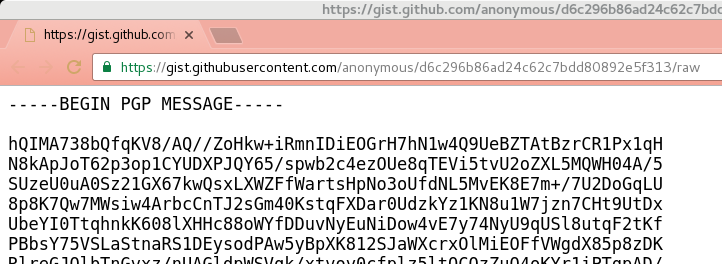

my-shadow
=========

## Introduction

> (...) social media has turned into “social peacocking” — showing yourself in a favorable light online, presenting only the happy moments, a “highlights reel” of your life, so to speak, and how this leads to FOMO in others (...) [[Caterina Fake, "Social Peacocking and the Shadow", 5 February 2015](https://caterina.net/2015/02/05/social-peacocking-and-the-shadow/)]

> (...) You never see any of the doldrums, the dullness, the boredom, the bad days, the... all of the things that are not presentable, not photogenic, (...) this constant sort of self-presentation that I call "social peacocking" is just kind of a mechanism for resentment, envy and dissatisfaction. (...) this tendency of people to productize themselves, to become a shinier, newer, more polished, quote-unquote better version of themselves, that we don't ignore large aspects of ourselves online, that our full humanity is represented there with all of its flaws. I wrote a subsequent blog post, also about The Shadow, as exemplified by Carl Jung, this idea that, you know, The Shadow, if it doesn't exist, you know, it leads to big problems, and I think that social media has a very strong tendency to ignore The Shadow. (...) The Shadow in Carl Jung are the things that we prefer not to present about ourselves, or acknowledge about ourselves, or unconscious about ourselves, such as, you know, our childishness or our envy or resentment (...) [[Caterina Fake interviewed by Manoush Zamorodi for the "When FOMO meets JOMO" episode of WNYC Note To Self, 20 January 2016, starts at 2:47](https://www.wnyc.org/story/fomo-jomo/)]

*my-shadow* is a prototype of social media service that breaks the social peacocking trap by allowing the user to unleash her Shadow.

Unleashing your Shadow is good - and possibly even healthy - but unveiling it to anybody may be inappropriate or inconvenient to say the least. With *my-shadow* your updates are accessible to your trusted circle only, using end-to-end encryption.

Public, free channels such as Twitter and GitHub's "Gist" are used to publish the encrypted updates, so that there is no cost for the service. At the same time, the user benefits from the services' infrastructure and high availability.

## Do I need *my-shadow*?

Similar functionality to *my-shadow* could be implemented for example by using a private Twitter account or a restricted Facebook groups, but do you really want them to be able to snoop into your Shadow?

Alternatively, you may be disciplined enough to do the whole encryption and email sending work manually, but the metadata generated by doing that would reveal who is in your circle to whoever manages email for you, or has privileged access in monitoring the networks: your Internet provider, your government etc.

## How does it work?

You write your "update" in a simple text file, say ```message.txt```, and you publish it by using the ```update``` command, as in the example below:

```
$ echo "I feel like eating pizza now!" > /tmp/message.txt
$ myshadow update /tmp/message.txt
$
```

In the background, the message is encrypted using [GnuPG](https://www.gnupg.org/) so that all of the readers you have previously configured can read it. The encrypted message is published pseudoanonymously on [Gist](https://gist.github.com/) (it's just *pseudo*anonymously because the people at GitHub will know it came from your IP address).



Note that the gists are "secret" meaning that they are not searchable, but anyone who knows the URL can access them.

A link to the secret gist is posted to your "shadow" Twitter feed.


Then, to read your shadow Twitter timeline, just use the ```timeline``` command:

```
$ myshadow timeline
ID,Posted at,Screen name,Text
815942398660452352,2017-01-02 15:26:41 +0000,giaceccosshadow,I feel like eating pizza now!
815497526019321856,2017-01-01 09:58:56 +0000,giaceccosshadow,"[CAN'T TOUCH THIS]"
815283589197733889,2016-12-31 19:48:49 +0000,giaceccosshadow,"[CAN'T TOUCH THIS]"
$
```

The output is valid CSV text, in case someone wanted to build a fancy GUI on top of this. Note that the text is truncated to 140 characters, as in Twitter, and new lines are ignored. To read the full message, and see any new lines, do ```myshadow status [status_id]```, where *status_id* is the tweet ID, that is the long number in the first column of the CSV.

## How do I decide who can read me?

At the moment, it is up to you to create an original GPG keypair for each reader you want to be able to read you. Don't forget to create a user for yourself if you want to be able to read your own Shadow.

There are many reasons for using original keypairs rather than your reader's pre-existing GPG public key; among these are:

- you may not want your reader to have access to your timeline straight away, but only at some point in the future, when you feel ready;

- you may also want to revoke that privilege for future messages, and  

- public, general purpose GPG keys can embed the owner's name and email address and the GPG client shows them at the moment of decryption; you may not want your readers to know who the other readers are.

The creation of keypairs is done by using the ```createrecipient``` command, e.g.

```
$ myshadow createrecipient "mickey mouse"
gpg: writing public key to `/home/giacecco/.myshadow/mickey mouse.pub'
gpg: writing secret key to `/home/giacecco/.myshadow/mickey mouse.sec'
.......+++++
..........+++++
gpg: writing self signature
gpg: RSA/SHA1 signature from: "B4891974 [?]"
.......+++++
........+++++
gpg: writing key binding signature
gpg: RSA/SHA1 signature from: "B4891974 [?]"
gpg: RSA/SHA1 signature from: "0B9A9B85 [?]"
gpg: writing key binding signature
gpg: RSA/SHA1 signature from: "B4891974 [?]"
gpg: RSA/SHA1 signature from: "0B9A9B85 [?]"
gpg: done
$
```

The nickname you've chosen for the recipient is not stored anywhere in the keys, but only in the names of the files.

The day you are ready for your reader to actually read your timeline, you will have to find a way to share with her the keypair securely. After you do that, you can delete your copy of the secure key only (the file ending in ```.sec```), as you will still need the public key (the file ending in ```.pub```).

The keypairs are created without a password and are stored in *my-shadow*'s keys folder, that by default is ```$HOME/.myshadow```. You can choose any other folder by using the ```--shadow``` parameter in all commands, e.g. ```myshadow createrecipient --shadow $HOME/.config/myshadow "[recipient nickname]"```. The folder is created if it does not exist already. Different keys folders can be used to broadcast different updates to different audiences, e.g. one for your friends, one for your family etc.

It is important that you keep *my-shadow*'s keys folder secure, and that you don't backup it lightheartedly, e.g. on an external hard disk or on Amazon AWS without a further layer of encryption.

You can prevent a reader from reading future messages by deleting her keypair from the ```secret``` folder.

## Requirements
*my-shadow* was developed and tested on Fedora 24. It should work without changes on most Linux distributions and, with little adaptation, on Mac. Requirements are:

- GnuPG 1.x
- [sferik/t](https://github.com/sferik/t), a command line Twitter client
- [defunkt/gist](https://github.com/defunkt/gist), a command line Gist client
- [csvfix](http://neilb.bitbucket.org/csvfix/), a command line CSV wrangler

## Installation

1. If you don't use it already, install *GnuPG* and configure it normally, as if you wanted to exchange encrypted messages without using *my-shadow*. This means creating your own general purpose keypair etc. **Your default private key is the one that is used for encryption** (but [this may change](https://github.com/Digital-Contraptions-Imaginarium/my-shadow/issues/6), opinions are welcome).

2. Install all the other prerequisites and make the ```gpg```, ```t```, ```gist``` and ```csvfix``` binaries and the ```myshadow``` bash file discoverable in the $PATH. Check that they work.

3. Configure *t* and move the Twitter credentials file created by doing so from ```~/.trc``` to ```$HOME/.myshadow/twitter.credentials``` (or any other folder you have chosen as *my-shadow*'s keys folder). Test to see if *t* works, e.g. by reading someone else's timeline: ```t timeline giacecco --profile=$HOME/.myshadow/twitter.credentials```.

## Known issues

By design, *my-shadow* relies on the generosity of the free services it is built upon: Twitter and GitHub's Gist. This dependence is also *my-shadow*'s main weakness, in case the services changed. For example:

- Twitter may decide that the use *my-shadow* makes of their service violates [their T&Cs](https://twitter.com/tos), or they may change the T&Cs to make it so. Twitter may take down your Shadow feed and you may never be able to recover the list of your past updates unless you made a backup of it.

- GitHub says that anonymous gists like the ones used by *my-shadow* [are never deleted](https://help.github.com/articles/creating-gists/#creating-an-anonymous-gist) but they may change their mind.

The way the keypairs are not password protected is also a weakness, as it requires the user to be strict in limiting access to the files. However, we thought that the effort required of the user to store each reader's secret key password until the day the key is handed over to the reader would have added a level of complexity that was worse than the complication of the current solution.

## Disclaimer

GPG security is great, but no encryption is safe forever. *my-shadow* uses GPG's strongest possible, 4096 bit RSA keys, but as computers become more powerful and inexpensive someone some day will be able to crack open your *my-shadow* feed. Moreover, you may make silly mistakes, such as share any of your readers' private keys in the clear on the Internet, e.g. sending the key to them by email etc. Don't try to blame me when something goes wrong and your Shadow is unveiled.

## Licence
*my-shadow* is released under the MIT licence, see [here](LICENSE).
